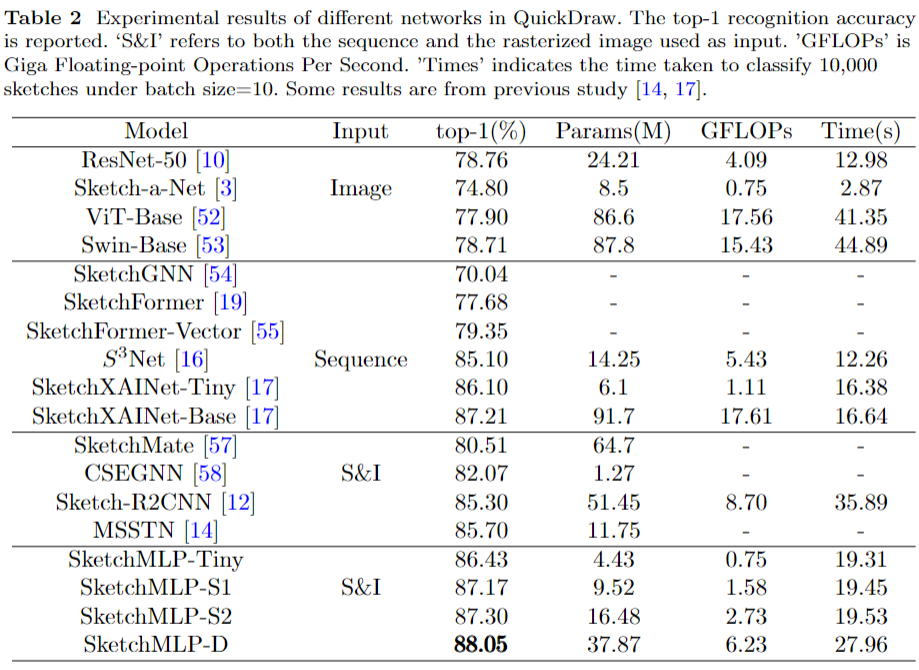
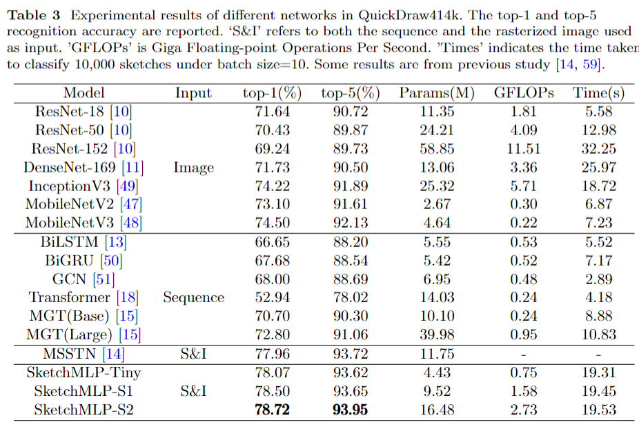

# SketchMLP: Effectively Utilize Rasterized Images and Drawing Sequences for Sketch Recognition
This is the official implementation of the paper "SketchMLP: Effectively Utilize Rasterized Images and Drawing Sequences for Sketch Recognition".
SketchMLP is an effective model for sketch recognition.

# Installation
```
git clone https://github.com/CMACH508/SketchMLP/
cd SketchMLP
pip install -r requirements.txt
mkdir Dataset
mkdir pretrain
```
# Preparing Dataset
Download QuickDraw dataset from the [Google drive](https://quickdraw.withgoogle.com/data), store it into './QuickDraw', and using 'data_processing.ipynb' to preprocess the data.
Dowload QuickDraw414k dataset from [URL1](https://drive.google.com/uc?id=1q933KpmJGkfStgIbwMfgfls1_1ZJVFyd) and [URL2](https://drive.google.com/uc?id=1Vrf1ouhtWYJp4XKa6jestLGY3aVlxfLC). Unzip them into the './Dataset' folder.
We also provide the processed data (including QuickDraw and QuickDraw414k) in [Baidu Netdisk](https://pan.baidu.com/s/1ls9v8NI5UcX5AMRAqliP6g?pwd=ofg1) with extraction code (提取码)：ofg1.

# Train
```
vim './Hyper_params.py'
modify the parameters and dataset
python -u Train.py
```

# Test
```
Move your model into the './pretrain' folder.
Then, rename the model as 'QD.pkl' (trained on QuickDraw) or 'QD414k.pkl' (trained on QuickDraw414k).
python -u Eval.py
```

The pretrained weights and the corresponding 'Hyper_params.py' files can be accessed by [Baidu Netdisk](https://pan.baidu.com/s/1wcIOyA3QLZsqvxIZdey-oQ?pwd=hk6e) with extraction code (提取码)：hk6e.

# QuickDraw


# QuickDraw414k

